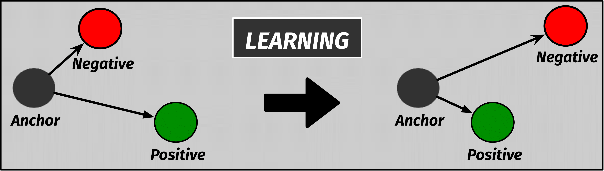

# PAPER's TITLE

Lorem ipsum dolor sit amet, consectetur adipiscing elit. Duis consequat nunc nec vehicula egestas. Integer suscipit urna orci, nec luctus libero sollicitudin eu. Donec at vehicula quam. Ut suscipit at neque eget mollis. Proin euismod odio vel quam egestas sodales at sit amet nibh. Maecenas eros dolor, posuere quis laoreet ut, suscipit nec augue. Duis iaculis pharetra tempor. Ut rhoncus orci consequat mattis ultrices. Integer ornare ex in accumsan accumsan. Nunc eu mi non velit feugiat malesuada eget vel quam. Mauris massa ex, fermentum ac lacus id, ultrices vestibulum orci.

#### Pipeline Description

To build SIDE (Summary alIgnment to coDe sEmantics), we relied on Contrastive learning to learn an embedding space where similar sample pairs (i.e., pairs sharing specific features) are clustered together while dissimilar pairs are set apart. In our context, we want to use contrastive learning to teach the model in discriminating textual summaries being suitable for a given code snippet vs summaries which are unsuitable.

#### Contrastive Loss
In our study, we employ the Triplet loss, which have been shown to better encode the positive/negative samples as compared to other contrastive losses . The triplet loss function has been proposed by Schroff et. al  and introduces the concept of "anchor". Given an anchor $x$, a positive ($x^{+}$) and a negative ($x^{-}$) sample is selected, with the triplet loss which during training minimizes the distance between the $x$ and $x^{+}$, while maximizing the distance between $x$ and $x^{-}$:

$$
	E=\max \left(\left\|f_a-f_p\right\|^2-\left\|f_a-f_n\right\|^2+m, 0\right)
$$

In our case, the anchor is the code to document, with a suitable summary representing $x^{+}$ and an unsuitable summary representing $x^{-}$. In the following sections we introduce the dataset used to fine-tune MPNet for the task of interest, explaining how we generate positive and negative samples.

From the graphical point of view:

* ##### Datasets :paperclip:

    The datasets for the pre-training and fine-tuning the model are stored on GDrive <a href="https://drive.google.com/drive/folders/1QEAxX461DxsNqxYFIAxJ8NYOdU3VayY2?usp=sharing">here</a>
    Please notice, that the TF implementation needs TSV files to work properly. Make sure you pick the correct ones from our GDrive folder.
    

* ##### Fine-tuned Models :computer:
    To pre-train and then fine-tune T5, you can use the script we provide here:
    -  <a href ='https://github.com/GHAR-ICSE/workflow-completion/blob/main/Code/T5/Pre_Training_Actions.ipynb'>Pre-Training</a> 
    -  <a href ='https://github.com/GHAR-ICSE/workflow-completion/blob/main/Code/T5/Fine_Tuning_Github.ipynb'>Fine-Tuning</a> 

* ##### Statistical Tests
    The code to replicate the statistical tests (i.e., McNemar and Wilcoxon) are available at the following links:
    -  <a href ='https://github.com/GHAR-ICSE/workflow-completion/blob/main/Code/Statistical-Tests/MC-Nemar.R'>McNemar</a> 
    -  <a href ='https://github.com/GHAR-ICSE/workflow-completion/blob/main/Code/Statistical-Tests/Wilcoxon.R'>Wilcoxon</a> 
    
    As for the data needed to perform the tests, we make these available <a href ='https://drive.google.com/drive/folders/1-ROI9eOWiqYn6Rsq-wU9eJ2uwHLrYfyE?usp=sharing'>here</a> 
    

* ##### Results:  :open_file_folder:  <a href="https://drive.google.com/drive/folders/1cq-sMYc5pvLpPf1vV1chOKka83TrZrgC?usp=sharing"> Click Me! </a> 

    
